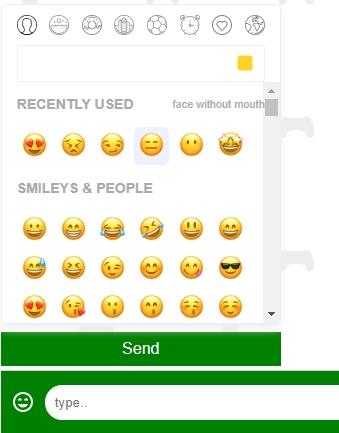

<!-- PROJECT LOGO -->
<br />
<p align="center">
  <a>
    
  </a>
</p>

<!-- TABLE OF CONTENTS -->
## Table of Contents

* [About the Project](#about-the-project)
  * [Built With](#built-with)
* [Getting Started](#getting-started)
  * [Prerequisites](#prerequisites)
  * [Installation](#installation)
* [Usage](#usage)
* [Contributers](#contributers)

<!-- ABOUT THE PROJECT -->
## About The Project


Meet New Friends is an application which is used to meet new people who are also using the site.
User can join chat rooms or create their own chat rooms to meet new friends.
Users in a chat room is able to chat with each other in real time without refreashing the page.
User will also be able to send and recieve emojis.



[Deployed project](https://meetnewfriends-51eaa.web.app/)


### Built With
* [ReactJS](https://reactjs.org/)
* [Javascript](https://www.javascript.com/)
* [Cloud Firestore](https://firebase.google.com/products/firestore)
* [Firebase Authentication](https://firebase.google.com/products/auth)
* [Firebase Hosting](https://firebase.google.com/products/hosting)
* [Material UI](https://material-ui.com/)
* [Node](https://nodejs.org/en/)
* [Toptal](https://www.toptal.com)

<!-- GETTING STARTED -->
## Getting Started

### Prerequisites

Have Visual Studio Code installed or similar application

### Installation

In your favorite terminal do the following:

1. Clone the repo
```sh
git clone https://github.com/adrianctwo/MeetNewFriends.git
```
2. Install NPM packages
```sh
npm install
```

<!-- USAGE EXAMPLES -->
## Usage

1. ***A user will be instructed to sign-in with their gmail account.***

2. ***Once logged in a user will be redirected to the home page***

3. ***On the home a user can do the following:***
    1. **Clicking a room on the leftside**
        1. This will auto-populate the chat for that room.
    2. **Clicking "Add Room**
        1. This will tigger a pop-up window asking the user to enter the name of the room.
        2. After user enter a name for the room, it will create the room and the user will be able to chat in the room that was created.

<!-- CONTRIBUTERS -->
## Contributers

Adrian Situ
