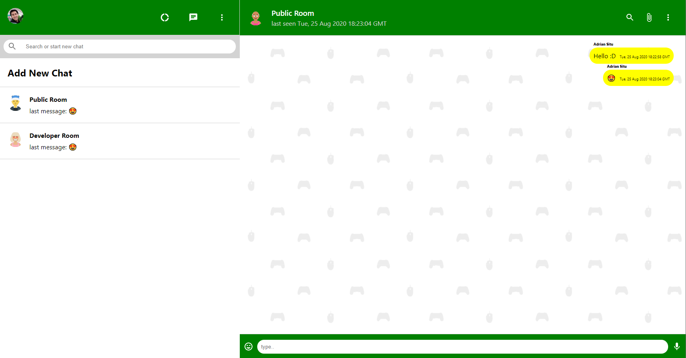

<!-- PROJECT LOGO -->
<br />
<p align="center">
  <a>
    
  </a>
</p>

<!-- TABLE OF CONTENTS -->
## Table of Contents

* [About the Project](#about-the-project)
  * [Built With](#built-with)
* [Getting Started](#getting-started)
  * [Prerequisites](#prerequisites)
  * [Installation](#installation)
* [Usage](#usage)
* [Contributers](#contributers)

<!-- ABOUT THE PROJECT -->
## About The Project



E-Betz is a application which is used to bet on live matches for video game tournaments.
A user is able to sign up with an account and will start with 10,000 credits.
Once signed in a user can find live matches and bet on teams that are going to play.

[Deployed project](https://ebetz.herokuapp.com/home)


### Built With
* [Bootstrap](https://getbootstrap.com)
* [Javascript](https://www.javascript.com/)
* [ReactJS](https://reactjs.org/)
* [Passport Google Strategy](http://www.passportjs.org/docs/google/)
* [Express](https://expressjs.com/)
* [MongoDB](https://www.mongodb.com/)
* [Node](https://nodejs.org/en/)
* [Pandascore API](https://pandascore.co/)

<!-- GETTING STARTED -->
## Getting Started

### Prerequisites

Have Visual Studio Code installed or similar application

### Installation

In your favorite terminal do the following:

1. Clone the repo
```sh
git clone https://github.com/adrianctwo/bet.git
```
2. Install NPM packages
```sh
npm install
```

<!-- USAGE EXAMPLES -->
## Usage

1. ***A user will be instructed to sign in, if a user doesn't have a log in they can created a account by clicking the sign up button.***

2. ***Once logged in a user will be redirected to the Tournament list page***

3. ***On the tournament page a user can do the following:***
    1. **Click a tournament**
        1. This will route you to the matches page

4. ***On the Matches page a user can do the following:***
    1. **Clicking a match**
        1. Once a match is click it will take the user to the match page which will show the teams playing each other with their roster.
        2. A user will be able to bet by clicking the bet now button
            1. A modal will pop up and the user will type how much they want to bet then click the submit button

<!-- CONTRIBUTERS -->
## Contributers

Adrian Situ - ReactJS, Pandascore API, User Interface

Angelo DePaolo - User Interface

Jared Cabanilla - Pandscore API & User Interface

Rachel Gundy - Authentication & User Interface


This project was bootstrapped with [Create React App](https://github.com/facebook/create-react-app).

## Available Scripts

In the project directory, you can run:

### `npm start`

Runs the app in the development mode.<br />
Open [http://localhost:3000](http://localhost:3000) to view it in the browser.

The page will reload if you make edits.<br />
You will also see any lint errors in the console.

### `npm test`

Launches the test runner in the interactive watch mode.<br />
See the section about [running tests](https://facebook.github.io/create-react-app/docs/running-tests) for more information.

### `npm run build`

Builds the app for production to the `build` folder.<br />
It correctly bundles React in production mode and optimizes the build for the best performance.

The build is minified and the filenames include the hashes.<br />
Your app is ready to be deployed!

See the section about [deployment](https://facebook.github.io/create-react-app/docs/deployment) for more information.

### `npm run eject`

**Note: this is a one-way operation. Once you `eject`, you can’t go back!**

If you aren’t satisfied with the build tool and configuration choices, you can `eject` at any time. This command will remove the single build dependency from your project.

Instead, it will copy all the configuration files and the transitive dependencies (webpack, Babel, ESLint, etc) right into your project so you have full control over them. All of the commands except `eject` will still work, but they will point to the copied scripts so you can tweak them. At this point you’re on your own.

You don’t have to ever use `eject`. The curated feature set is suitable for small and middle deployments, and you shouldn’t feel obligated to use this feature. However we understand that this tool wouldn’t be useful if you couldn’t customize it when you are ready for it.

## Learn More

You can learn more in the [Create React App documentation](https://facebook.github.io/create-react-app/docs/getting-started).

To learn React, check out the [React documentation](https://reactjs.org/).

### Code Splitting

This section has moved here: https://facebook.github.io/create-react-app/docs/code-splitting

### Analyzing the Bundle Size

This section has moved here: https://facebook.github.io/create-react-app/docs/analyzing-the-bundle-size

### Making a Progressive Web App

This section has moved here: https://facebook.github.io/create-react-app/docs/making-a-progressive-web-app

### Advanced Configuration

This section has moved here: https://facebook.github.io/create-react-app/docs/advanced-configuration

### Deployment

This section has moved here: https://facebook.github.io/create-react-app/docs/deployment

### `npm run build` fails to minify

This section has moved here: https://facebook.github.io/create-react-app/docs/troubleshooting#npm-run-build-fails-to-minify
